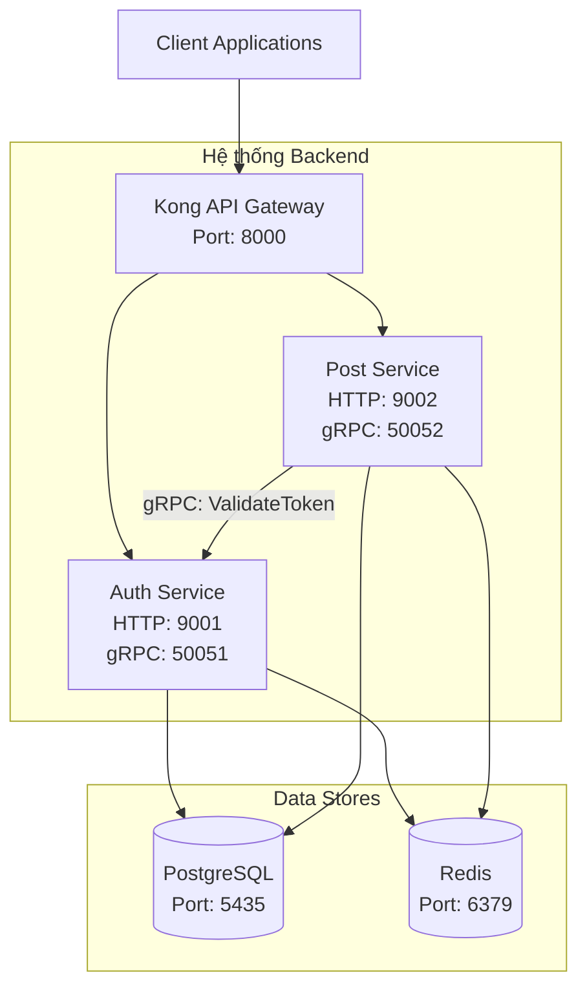

# 🏗️ Kiến trúc Hệ thống

### Sơ đồ các thành phần

### Luồng Giao tiếp Chính

1.  **Client-to-Backend (RESTful API):**
    *   Tất cả các request từ bên ngoài đều phải đi qua **Kong API Gateway**.
    *   Kong sẽ dựa vào đường dẫn (`/auth/*` hoặc `/post/*`) để định tuyến (route) request đến service tương ứng.
    *   Kong chịu trách nhiệm áp dụng các chính sách chung như Rate Limiting.

2.  **Service-to-Service (gRPC):**
    *   Khi **Post Service** cần xác thực một hành động (ví dụ: tạo bài viết), nó sẽ không gọi qua API Gateway mà sẽ gọi trực tiếp đến **Auth Service** thông qua gRPC.
    *   **Lý do dùng gRPC:** Hiệu năng cao, overhead thấp, phù hợp cho giao tiếp nội bộ giữa các microservices.
    *   **Luồng ví dụ:** `Post Service` nhận request tạo bài viết -> Gọi hàm `validateToken` trên `Auth Service` qua gRPC -> `Auth Service` trả về thông tin user -> `Post Service` tiếp tục xử lý.

---
> *Để xem chi tiết cấu trúc CSDL, vui lòng tham khảo [docs/architecture/database_schema.md](./docs/architecture/database_schema.md).*
