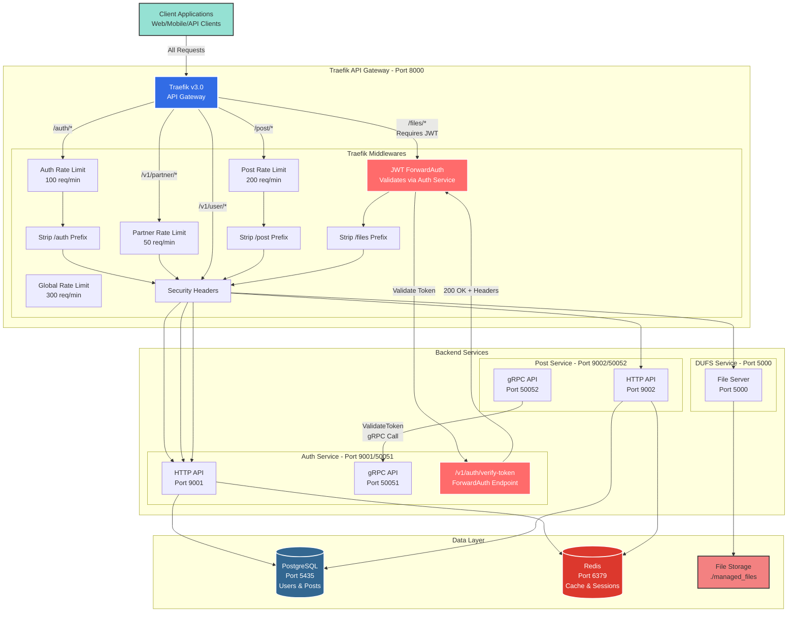
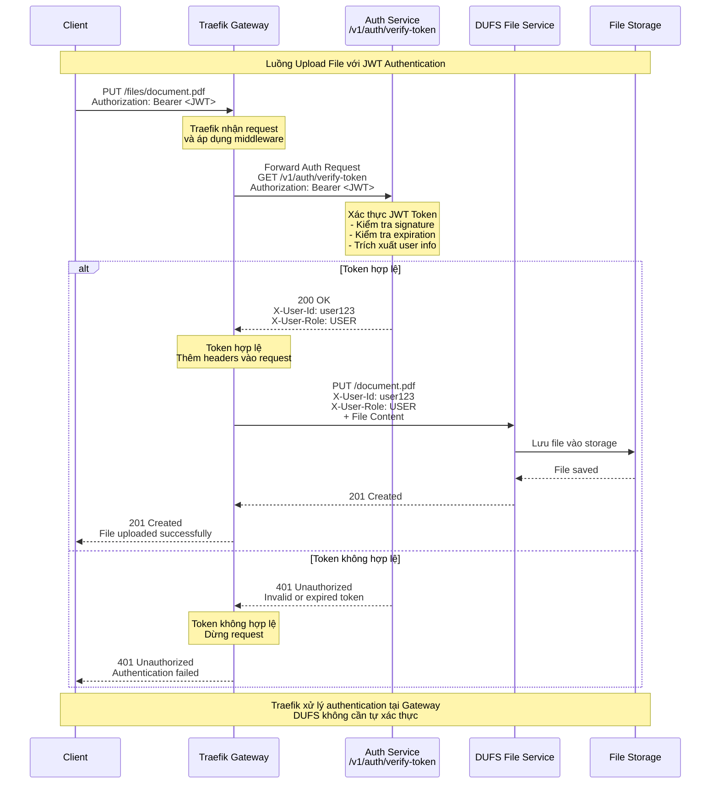

# 🏗️ Kiến trúc Hệ thống

## Tổng quan

Hệ thống được xây dựng theo mô hình **Microservices** với **Traefik v3.0** làm API Gateway. Traefik đóng vai trò là cổng vào duy nhất, xử lý routing, rate limiting, JWT authentication và các middleware khác trước khi chuyển tiếp request đến các backend services.

### Sơ đồ Kiến trúc Tổng thể



---

## Các Thành phần Chính

### 1. Traefik API Gateway (Port 8000)

**Traefik v3.0** là API Gateway hiện đại, cloud-native được thiết kế cho microservices. Traefik đóng vai trò:

- **Reverse Proxy**: Định tuyến request đến các backend services
- **Load Balancer**: Cân bằng tải giữa các instances (nếu có)
- **Middleware Engine**: Áp dụng các middleware như rate limiting, authentication, headers
- **Service Discovery**: Tự động phát hiện services từ Docker
- **Health Checks**: Giám sát sức khỏe của các backend services

**Cấu hình:**
- Static config: `traefik/traefik.yml` (production) và `traefik/traefik.dev.yml` (development)
- Dynamic config: `traefik/dynamic-config.yml` (production) và `traefik/dynamic-config.dev.yml` (development)
- Dashboard: Có sẵn trên port 8080 trong development mode

### 2. Auth Service (Port 9001 HTTP / 50051 gRPC)

Service quản lý xác thực và người dùng:

- **HTTP API (Port 9001)**: RESTful endpoints cho authentication
  - `/v1/auth/signup` - Đăng ký người dùng mới
  - `/v1/auth/login` - Đăng nhập
  - `/v1/auth/refresh` - Làm mới access token
  - `/v1/auth/verify-token` - **Endpoint mới cho Traefik ForwardAuth**
  - `/v1/user/*` - Quản lý thông tin người dùng
  - `/v1/partner/*` - Tích hợp Firebase authentication

- **gRPC API (Port 50051)**: Inter-service communication
  - `ValidateToken` - Xác thực JWT token cho các services khác

- **Database**: PostgreSQL (users table)
- **Cache**: Redis (sessions, tokens)

### 3. Post Service (Port 9002 HTTP / 50052 gRPC)

Service quản lý bài viết:

- **HTTP API (Port 9002)**: RESTful endpoints cho posts
  - CRUD operations cho bài viết
  - Tìm kiếm và phân trang

- **gRPC Client**: Gọi Auth Service để xác thực token

- **Database**: PostgreSQL (posts table)
- **Cache**: Redis

### 4. DUFS Service (Port 5000)

File server được viết bằng Rust, hiệu năng cao:

- Upload/Download/Delete files
- Được bảo vệ bởi JWT authentication tại Traefik Gateway
- Lưu trữ files trong `./managed_files` directory
- **Không cần tự xác thực** - Traefik đã xử lý authentication

### 5. PostgreSQL (Port 5435)

Database quan hệ chính:
- Schema `users` (Auth Service)
- Schema `posts` (Post Service)
- Centralized migrations trong `./migrations`

### 6. Redis (Port 6379)

Cache và session store:
- Cache dữ liệu thường xuyên truy cập
- Lưu trữ refresh tokens
- Session management

---

## Luồng Giao tiếp Chính

### 1. Client-to-Backend (RESTful API qua Traefik)

Tất cả các request từ client đều phải đi qua **Traefik API Gateway**:

1. Client gửi request đến `http://gateway:8000/auth/login`
2. Traefik nhận request và áp dụng middlewares:
   - Global rate limiting (300 req/min)
   - Auth-specific rate limiting (100 req/min)
   - Strip `/auth` prefix
   - Add security headers
3. Traefik forward request đến Auth Service: `http://auth-service:9001/v1/auth/login`
4. Auth Service xử lý và trả response
5. Traefik forward response về client

**Routing Rules:**
- `/auth/*` → Auth Service (strip prefix)
- `/v1/user/*` → Auth Service (no strip)
- `/v1/partner/*` → Auth Service (no strip)
- `/post/*` → Post Service (strip prefix)
- `/files/*` → DUFS Service (strip prefix, **requires JWT**)

### 2. JWT Authentication với Traefik ForwardAuth

**Đây là tính năng quan trọng nhất** - Traefik xử lý JWT authentication cho DUFS Service:

#### Cơ chế ForwardAuth:

1. Client gửi request đến `/files/*` với JWT token:
   ```
   PUT /files/document.pdf
   Authorization: Bearer eyJhbGc...
   ```

2. Traefik áp dụng **ForwardAuth middleware**:
   - Forward authentication request đến Auth Service
   - Endpoint: `http://auth-service:9001/v1/auth/verify-token`
   - Headers: `Authorization: Bearer eyJhbGc...`

3. Auth Service xác thực token:
   - Kiểm tra signature với secret key
   - Kiểm tra expiration time
   - Kiểm tra issuer (`backend-works-app`)
   - Trích xuất user information

4. Nếu token **hợp lệ**:
   - Auth Service trả về `200 OK`
   - Response headers: `X-User-Id`, `X-User-Role`
   - Traefik thêm headers này vào request gốc
   - Traefik forward request đến DUFS Service

5. Nếu token **không hợp lệ**:
   - Auth Service trả về `401 Unauthorized`
   - Traefik dừng request và trả lỗi về client
   - DUFS Service không nhận được request

#### Sơ đồ Luồng JWT Authentication:



**Lợi ích của ForwardAuth:**
- ✅ Centralized authentication tại Gateway
- ✅ DUFS Service không cần implement JWT validation
- ✅ Dễ dàng thay đổi authentication logic
- ✅ Giảm tải cho backend services
- ✅ Consistent authentication across services

### 3. Service-to-Service Communication (gRPC)

Khi **Post Service** cần xác thực token (ví dụ: tạo bài viết):

1. Client gửi request `POST /post` với JWT token
2. Traefik forward đến Post Service
3. Post Service gọi gRPC `ValidateToken` đến Auth Service
4. Auth Service xác thực và trả về user info
5. Post Service tạo bài viết với `createdBy = userId`

**Lý do dùng gRPC:**
- Hiệu năng cao hơn REST
- Overhead thấp
- Type-safe với Protocol Buffers
- Phù hợp cho internal communication

### 4. Tích hợp Partner (Firebase Authentication)

Hệ thống hỗ trợ xác thực qua Firebase cho các partner/third-party:

1. **Client** xác thực với Firebase và nhận `Firebase ID Token`
2. **Client** gọi `GET /v1/partner/verify` đến Traefik Gateway:
   ```
   Headers:
   - x-client-id: <project_id>
   - x-client-secret: <Firebase ID Token>
   ```
3. **Traefik** forward request đến Auth Service (với partner rate limit: 50 req/min)
4. **Auth Service** xử lý:
   - Lấy Firebase credentials từ database (`third_party_integrations` table)
   - Xác thực Firebase ID Token bằng Firebase Admin SDK
   - Tạo hoặc cập nhật user trong hệ thống
   - Tạo `accessToken` và `refreshToken` của hệ thống
5. **Client** nhận tokens và sử dụng để truy cập các API khác

---

## Traefik Middlewares

Traefik sử dụng các middleware để xử lý request trước khi forward đến backend:

### 1. Rate Limiting Middlewares

| Middleware | Áp dụng cho | Limit | Burst |
|------------|-------------|-------|-------|
| `global-rate-limit` | Tất cả routes | 300 req/min | 50 |
| `auth-rate-limit` | `/auth/*` | 100 req/min | 20 |
| `post-rate-limit` | `/post/*` | 200 req/min | 40 |
| `partner-rate-limit` | `/v1/partner/*` | 50 req/min | 10 |

### 2. Path Stripping Middlewares

- `strip-auth-prefix`: Loại bỏ `/auth` prefix
- `strip-post-prefix`: Loại bỏ `/post` prefix
- `strip-files-prefix`: Loại bỏ `/files` prefix

**Ví dụ:**
- Request: `GET /auth/v1/auth/login`
- Sau strip: `GET /v1/auth/login`
- Forward đến: `http://auth-service:9001/v1/auth/login`

### 3. JWT ForwardAuth Middleware

Middleware quan trọng nhất cho file service:

```yaml
jwt-auth:
  forwardAuth:
    address: "http://auth-service:9001/v1/auth/verify-token"
    authResponseHeaders:
      - "X-User-Id"
      - "X-User-Role"
```

### 4. Security Headers Middleware

Thêm các security headers vào response:
- `X-Frame-Options: DENY`
- `X-Content-Type-Options: nosniff`
- `X-XSS-Protection: 1; mode=block`

---

## Traefik Routers và Priority

Traefik sử dụng priority để xác định router nào được áp dụng khi có nhiều rules match:

| Router | Rule | Priority | Middlewares |
|--------|------|----------|-------------|
| `partner-routes` | `PathPrefix(/v1/partner)` | 200 | partner-rate-limit, security-headers |
| `user-routes` | `PathPrefix(/v1/user)` | 150 | security-headers |
| `auth-routes` | `PathPrefix(/auth)` | 100 | strip-auth-prefix, auth-rate-limit, security-headers |
| `post-routes` | `PathPrefix(/post)` | 100 | strip-post-prefix, post-rate-limit, security-headers |
| `dufs-routes` | `PathPrefix(/files)` | 100 | **jwt-auth**, strip-files-prefix, security-headers |

**Priority cao hơn = được kiểm tra trước**

---

## Health Checks

### Traefik Health Check

Traefik cung cấp ping endpoint:
```bash
curl http://localhost:8000/ping
# Response: OK
```

### Service Health Checks

Traefik tự động kiểm tra health của các backend services:

| Service | Health Check Path | Interval | Timeout |
|---------|-------------------|----------|---------|
| Auth Service | `/health` | 30s | 10s |
| Post Service | `/health` | 30s | 10s |
| DUFS Service | `/__dufs__/health` | 30s | 10s |

Nếu service không healthy, Traefik sẽ không forward request đến service đó.

---

## Development vs Production

### Development Mode (`./dev.sh`)

- **Traefik**: Chạy trong Docker với dashboard enabled (port 8080)
- **Auth/Post Services**: Chạy local (ports 3001, 3002) với hot-reload
- **Database/Redis**: Chạy trong Docker
- **Dynamic config**: Sử dụng `host.docker.internal` để truy cập local services

**Traefik Dashboard:** http://localhost:8080

### Production Mode (`./prod.sh`)

- **Tất cả services**: Chạy trong Docker
- **Traefik**: Dashboard disabled, chỉ expose port 8000
- **Internal network**: Services giao tiếp qua Docker network
- **Security**: Tất cả services chỉ accessible qua Traefik

---

## So sánh Kong vs Traefik

| Tính năng | Kong (Cũ) | Traefik (Mới) |
|-----------|-----------|---------------|
| **JWT Authentication** | Built-in JWT plugin | ForwardAuth middleware + Auth Service |
| **Configuration** | Declarative YAML | Static + Dynamic YAML |
| **Dashboard** | Kong Manager (Enterprise) | Built-in Dashboard (Free) |
| **Service Discovery** | Manual config | Auto-discovery từ Docker |
| **Performance** | Good | Excellent (Go-based) |
| **Cloud-Native** | Yes | Yes (designed for K8s) |
| **Middleware System** | Plugins | Native middlewares |
| **Learning Curve** | Moderate | Easy |

**Lý do chuyển sang Traefik:**
- ✅ Modern và cloud-native hơn
- ✅ Dashboard miễn phí
- ✅ Flexible middleware system
- ✅ Better Docker/K8s integration
- ✅ Nhẹ hơn và nhanh hơn
- ✅ Cộng đồng active và documentation tốt

---

## Tài liệu Tham khảo

- **Traefik Documentation**: https://doc.traefik.io/traefik/
- **ForwardAuth Middleware**: https://doc.traefik.io/traefik/middlewares/http/forwardauth/
- **Docker Provider**: https://doc.traefik.io/traefik/providers/docker/
- **File Provider**: https://doc.traefik.io/traefik/providers/file/
