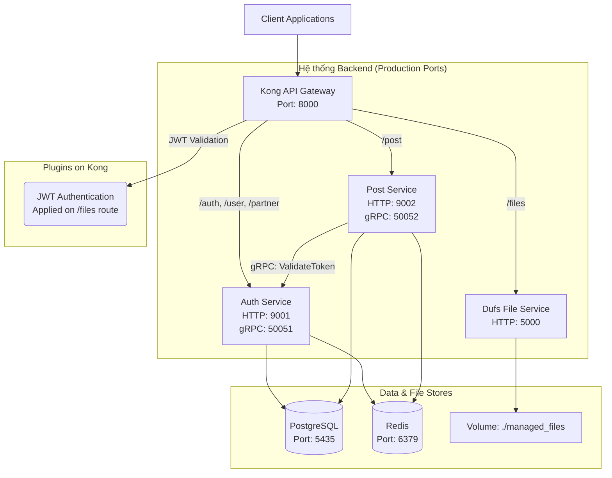

# 🏗️ Kiến trúc Hệ thống

### Sơ đồ các thành phần

### Luồng Giao tiếp Chính

1.  **Client-to-Backend (RESTful API):**
    *   Tất cả các request từ bên ngoài đều phải đi qua **Kong API Gateway**.
    *   Kong sẽ dựa vào đường dẫn (`/auth/*`, `/post/*`, `/files/*`) để định tuyến (route) request đến service tương ứng.
    *   Kong chịu trách nhiệm áp dụng các chính sách chung như Rate Limiting.

2.  **Xác thực JWT tại Gateway (cho File Service):**
    *   Route `/files/*` được bảo vệ bởi plugin **JWT** của Kong.
    *   Khi Client gửi request đến `/files/*`, nó phải đính kèm `accessToken` do **Auth Service** cấp.
    *   **Auth Service** tạo token với `key` (issuer) là `backend-works-app`.
    *   **Kong** sẽ kiểm tra chữ ký của token bằng `secret` đã được cấu hình. Nếu hợp lệ, request sẽ được chuyển tiếp đến **Dufs Service**.
    *   Luồng này giúp giảm tải cho các backend service, việc xác thực được xử lý ngay tại Gateway.

3.  **Service-to-Service (gRPC):**
    *   Khi **Post Service** cần xác thực một hành động (ví dụ: tạo bài viết), nó sẽ gọi trực tiếp đến **Auth Service** thông qua gRPC để xác thực token.
    *   **Lý do dùng gRPC:** Hiệu năng cao, overhead thấp, phù hợp cho giao tiếp nội bộ.

### Tích hợp Partner (Firebase Authentication)

1.  **Client** xác thực với Firebase và nhận được `Firebase ID Token`.
2.  **Client** gọi `GET /v1/partner/verify` đến **Kong Gateway**, đính kèm `x-client-id` (project_id) và `x-client-secret` (Firebase ID Token) trong headers.
3.  **Kong** chuyển tiếp request đến **Auth Service**.
4.  **Auth Service**:
    a. Lấy `private_key` và `client_email` của Firebase từ bảng `third_party_integrations` trong **PostgreSQL** dựa trên `project_id`.
    b. Sử dụng Firebase Admin SDK để xác thực `Firebase ID Token`.
    c. Nếu người dùng chưa tồn tại, tạo một người dùng mới.
    d. Tạo `accessToken` và `refreshToken` của hệ thống và trả về cho Client.
5.  **Client** sử dụng `accessToken` mới nhận được để tương tác với các API khác, bao gồm cả việc upload/download file qua **Dufs Service**.
