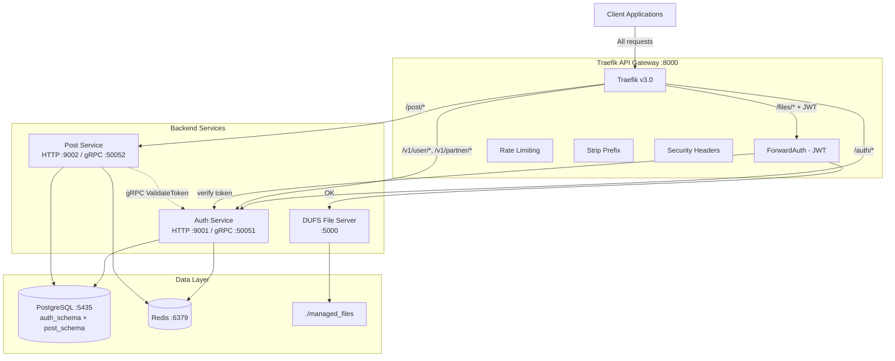
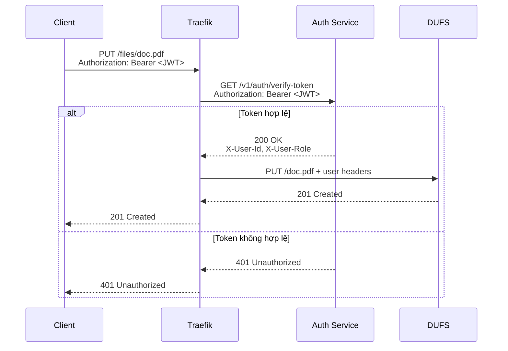
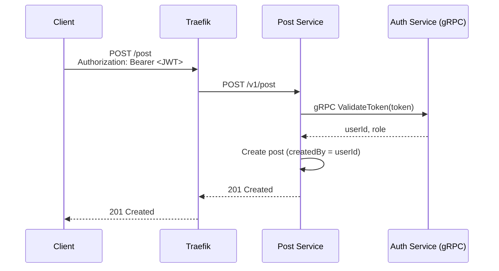

# Kiến trúc Hệ thống

## Tổng quan

Hệ thống NestJS Microservices được xây dựng theo mô hình **monorepo** với **Traefik v3.0** làm API Gateway. Mỗi service có schema riêng trong cùng một PostgreSQL instance, giao tiếp nội bộ qua gRPC.

## Sơ đồ Kiến trúc



## Cấu trúc Monorepo

```
nestjs-microservices/
├── auth/                  # Auth Service (NestJS)
│   ├── src/
│   │   ├── modules/auth/  # Authentication module
│   │   └── modules/user/  # User management module
│   ├── prisma/            # Prisma schema (auth_schema)
│   └── .env               # Local dev config
├── post/                  # Post Service (NestJS)
│   ├── src/
│   │   ├── modules/post/  # Post management module
│   │   └── services/auth/ # gRPC auth client
│   ├── prisma/            # Prisma schema (post_schema)
│   └── .env               # Local dev config
├── migrations/            # Centralized DB migrations
│   └── prisma/            # Master Prisma schema
├── traefik/               # Traefik configuration
│   ├── traefik.yml        # Static config (production)
│   ├── traefik.dev.yml    # Static config (development)
│   ├── dynamic-config.yml # Dynamic routing (production)
│   └── dynamic-config.dev.yml  # Dynamic routing (development)
├── docker-compose.yml     # Production (all in Docker)
├── docker-compose.dev.yml # Development (infra only)
├── dev.sh / dev-stop.sh   # Dev environment scripts
└── prod.sh                # Production script
```

## Các thành phần

### 1. Traefik API Gateway (Port 8000)

Cổng vào duy nhất, xử lý routing, rate limiting, và JWT authentication.

| Middleware | Mô tả | Áp dụng cho |
|------------|--------|-------------|
| `global-rate-limit` | 300 req/min, burst 50 | Tất cả routes |
| `auth-rate-limit` | 100 req/min, burst 20 | `/auth/*` |
| `post-rate-limit` | 200 req/min, burst 40 | `/post/*` |
| `partner-rate-limit` | 50 req/min, burst 10 | `/v1/partner/*` |
| `jwt-auth` | ForwardAuth → Auth Service | `/files/*` |
| `strip-*-prefix` | Bỏ prefix trước forward | `/auth`, `/post`, `/files` |
| `security-headers` | X-Frame-Options, etc. | Tất cả routes |

**Routing:**

| Router | Rule | Priority | Service |
|--------|------|----------|---------|
| `partner-routes` | `/v1/partner` | 200 | Auth |
| `user-routes` | `/v1/user` | 150 | Auth |
| `auth-routes` | `/auth` | 100 | Auth |
| `post-routes` | `/post` | 100 | Post |
| `dufs-routes` | `/files` (JWT required) | 100 | DUFS |

### 2. Auth Service (Port 9001 HTTP / 50051 gRPC)

Quản lý xác thực và người dùng:

- **HTTP API**: Signup, login, refresh token, verify-token (ForwardAuth), user profile, partner Firebase auth
- **gRPC**: `ValidateToken` — dùng bởi Post Service
- **Database**: `auth_schema` (users, Role enum)
- **Cache**: Redis (sessions, tokens, prefix `auth:`)

### 3. Post Service (Port 9002 HTTP / 50052 gRPC)

Quản lý bài viết:

- **HTTP API**: CRUD posts, search, pagination, bulk delete
- **gRPC Server**: `CreatePost`, `GetPost`, `GetPosts`, `UpdatePost`, `DeletePost`
- **gRPC Client**: Gọi Auth Service để validate token
- **Database**: `post_schema` (posts table)
- **Cache**: Redis (prefix `post:`)

### 4. DUFS File Server (Port 5000)

File server viết bằng Rust ([sigoden/dufs](https://github.com/sigoden/dufs)):

- Upload/Download/Delete files
- Lưu trong `./managed_files`
- **Không tự authenticate** — JWT được xử lý bởi Traefik ForwardAuth

### 5. PostgreSQL (Port 5435) + Redis (Port 6379)

- **PostgreSQL**: 1 instance, 2 schemas (`auth_schema`, `post_schema`)
- **Redis**: Cache, sessions, token storage
- Chi tiết: xem [database.md](database.md)

## Luồng JWT ForwardAuth (File Upload)



## Luồng gRPC (Post Service → Auth Service)



## Development vs Production

| | Development (`dev.sh`) | Production (`prod.sh`) |
|---|---|---|
| **Infra** | Docker (PG, Redis, Traefik, DUFS) | Docker (tất cả) |
| **Services** | Local (`npm run dev`, hot-reload) | Docker containers |
| **Traefik Dashboard** | ✅ Port 8080 | ❌ Disabled |
| **Service routing** | `host.docker.internal` | Docker network |
| **DB access** | `localhost:5435` | Internal `postgres:5432` |
