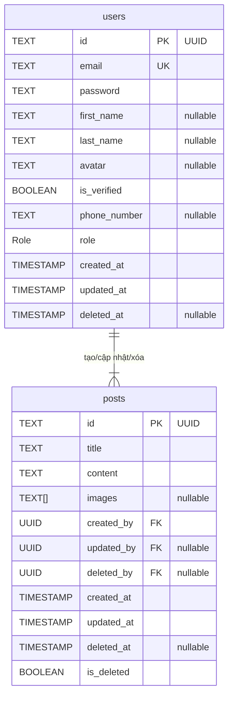

# 2. Sơ Đồ Cơ Sở Dữ Liệu (Database Schema)

Sơ đồ này mô tả cấu trúc của các bảng `users` và `posts` cùng với mối quan hệ giữa chúng.

### Sơ đồ ERD (Entity-Relationship Diagram)

### Chi tiết các bảng

**Enum `Role`**
| Value |
|-------|
| ADMIN |
| USER  |

---

**Bảng `users` (thuộc Auth Service)**

Lưu trữ thông tin người dùng và vai trò của họ.

| Tên cột | Kiểu dữ liệu | Ràng buộc | Diễn giải |
|--------------|----------------|----------------|-----------------------------------------|
| `id` | TEXT | **Primary Key** | ID duy nhất của người dùng (định dạng UUID) |
| `email` | TEXT | **Unique** | Địa chỉ email, dùng để đăng nhập |
| `password` | TEXT | | Mật khẩu đã được mã hóa |
| `first_name` | TEXT | nullable | Tên |
| `last_name` | TEXT | nullable | Họ |
| `avatar` | TEXT | nullable | URL ảnh đại diện |
| `is_verified`| BOOLEAN | `DEFAULT false` | Trạng thái xác thực email |
| `phone_number`| TEXT | nullable | Số điện thoại |
| `role` | Role | | Vai trò của người dùng (ADMIN hoặc USER) |
| `created_at` | TIMESTAMP | `DEFAULT NOW()`| Thời gian tạo tài khoản |
| `updated_at` | TIMESTAMP | | Thời gian cập nhật thông tin lần cuối |
| `deleted_at` | TIMESTAMP | nullable | Thời gian xóa mềm tài khoản |

---

**Bảng `posts` (thuộc Post Service)**

Lưu trữ nội dung các bài viết.

| Tên cột | Kiểu dữ liệu | Ràng buộc | Diễn giải |
|--------------|----------------|-----------------|-----------------------------------------|
| `id` | TEXT | **Primary Key** | ID duy nhất của bài viết (định dạng UUID) |
| `title` | TEXT | | Tiêu đề bài viết |
| `content` | TEXT | | Nội dung bài viết |
| `images` | TEXT[] | nullable | Mảng các URL hình ảnh của bài viết |
| `created_by` | UUID | **Foreign Key** | ID của người dùng đã tạo bài viết |
| `updated_by` | UUID | nullable, FK | ID của người dùng cập nhật bài viết lần cuối |
| `deleted_by` | UUID | nullable, FK | ID của người dùng đã xóa mềm bài viết |
| `created_at` | TIMESTAMP | `DEFAULT NOW()` | Thời gian tạo bài viết |
| `updated_at` | TIMESTAMP | | Thời gian cập nhật bài viết lần cuối |
| `deleted_at` | TIMESTAMP | nullable | Thời gian xóa mềm bài viết |
| `is_deleted` | BOOLEAN | `DEFAULT false` | Cờ đánh dấu bài viết đã bị xóa mềm |

### Mối quan hệ

*   **Một-nhiều (One-to-Many):** Một `user` có thể tạo, cập nhật, hoặc xóa nhiều `posts`.
    *   `posts.created_by` tham chiếu đến `users.id`.
    *   `posts.updated_by` tham chiếu đến `users.id`.
    *   `posts.deleted_by` tham chiếu đến `users.id`.
