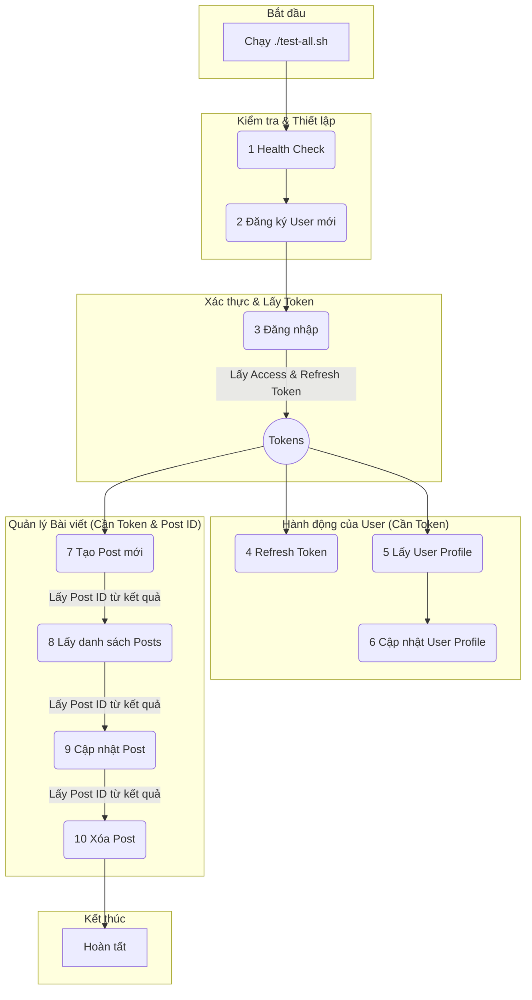

# 1. Luồng Thực Thi API Tests (`test-all.sh`)

Sơ đồ này mô tả trình tự các script được gọi khi bạn chạy `./test-all.sh`. Nó cũng thể hiện sự phụ thuộc giữa các script, ví dụ như phải đăng nhập thành công để lấy `token`, sau đó mới có thể thực hiện các hành động tiếp theo.

### Diễn giải luồng:
1.  **Health Check:** Kiểm tra tất cả các service có đang hoạt động hay không.
2.  **Đăng ký User:** Tạo một tài khoản người dùng mới để phục vụ cho các bước test sau.
3.  **Đăng nhập:** Dùng tài khoản vừa tạo để đăng nhập và lấy về `accessToken` và `refreshToken`. Đây là "chìa khóa" cho tất cả các hành động cần xác thực.
4.  **Các hành động của User:** Các script như làm mới token, lấy và cập nhật thông tin cá nhân đều cần `accessToken` hoặc `refreshToken`.
5.  **Quản lý Bài viết:** Toàn bộ các hành động liên quan đến bài viết (tạo, xem, sửa, xóa) đều yêu cầu `accessToken` để xác thực người dùng. Các hành động sửa/xóa thường cần lấy `Post ID` từ bước tạo hoặc xem danh sách trước đó.

