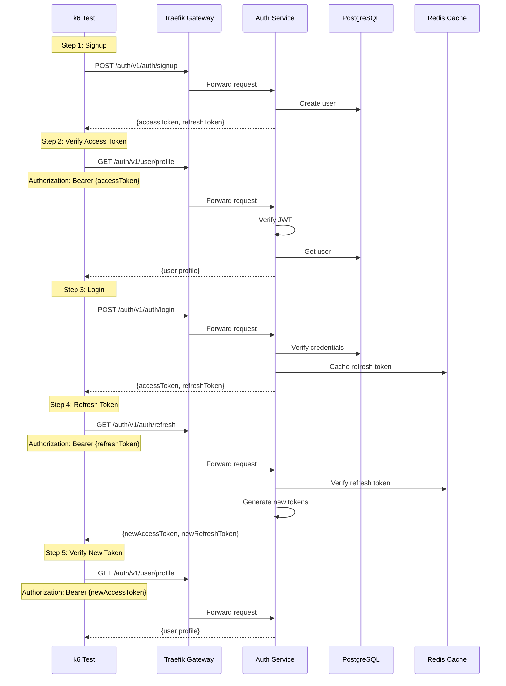

# Complete Auth Flow Test

## Flow Diagram

## Test Steps

1. **Signup**: Create new user account
2. **Verify Access Token**: Get user profile with access token
3. **Login**: Login with new user credentials
4. **Refresh Token**: Use refresh token to get new access token
5. **Verify New Token**: Verify new access token works

## Success Criteria

- All API calls return expected status codes
- Tokens are generated and validated correctly
- User can complete full authentication cycle

