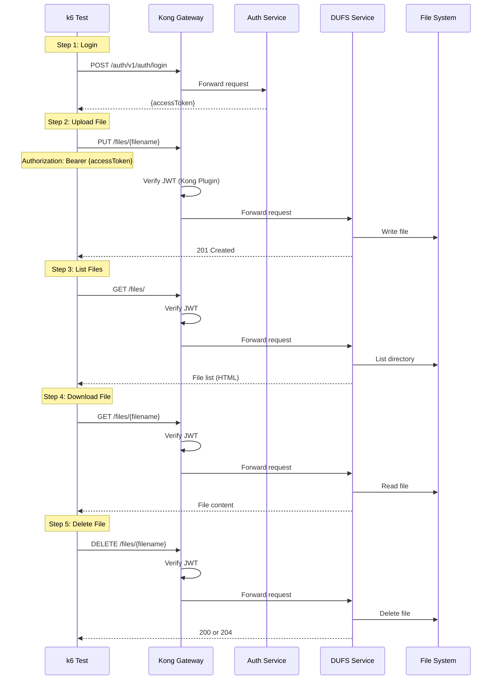

# Complete DUFS Flow Test

## Flow Diagram

## Test Steps

1. **Login**: Get access token
2. **Upload File**: Upload a test file
3. **List Files**: List all files in directory
4. **Download File**: Download the uploaded file
5. **Delete File**: Delete the uploaded file

## Success Criteria

- File upload, download, and delete operations work
- Kong JWT plugin validates tokens correctly
- Files are persisted to disk

