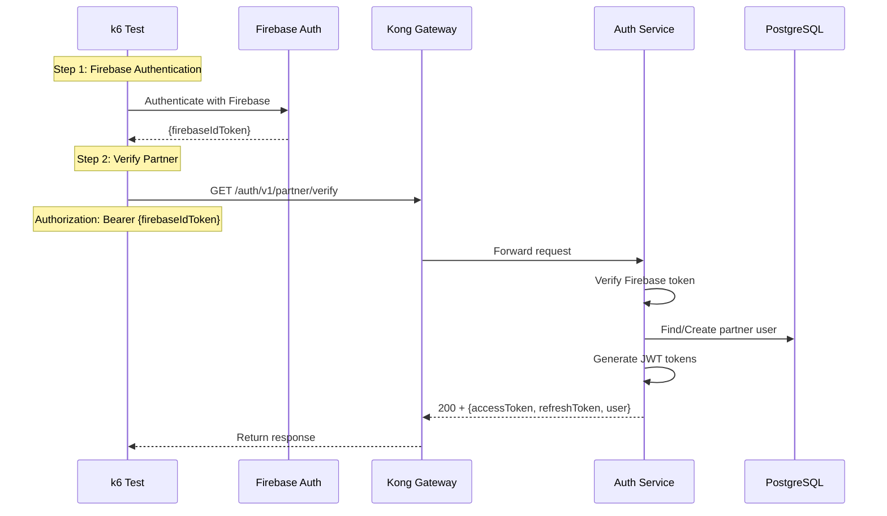

# Partner Verification Flow Test

## Flow Diagram

## Test Steps

1. **Firebase Authentication**: Authenticate with Firebase to get ID token
2. **Verify Partner**: Send Firebase ID token to partner verify endpoint
3. **Verify Response**: Check that partner was authenticated and JWT tokens were generated

## Note

This test requires Firebase configuration and is currently skipped. To enable:
- Configure Firebase Admin SDK in Auth service
- Provide Firebase test credentials
- Update test to use real Firebase authentication

## Success Criteria

- Firebase token is validated
- Partner user is created/found in database
- JWT tokens are generated for partner

