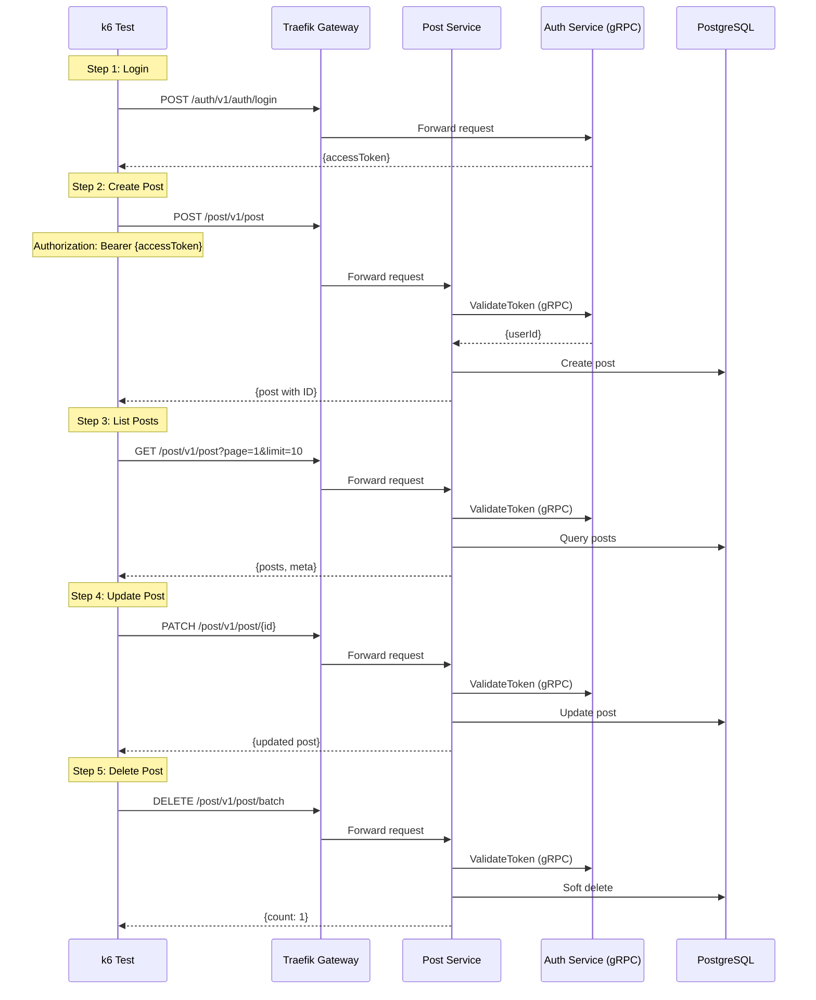

# Complete Post Flow Test

## Flow Diagram

## Test Steps

1. **Login**: Get access token
2. **Create Post**: Create a new post
3. **List Posts**: Retrieve posts with pagination
4. **Update Post**: Update the created post
5. **Delete Post**: Soft delete the post

## Success Criteria

- All CRUD operations complete successfully
- gRPC token validation works
- Post data is persisted and retrieved correctly

