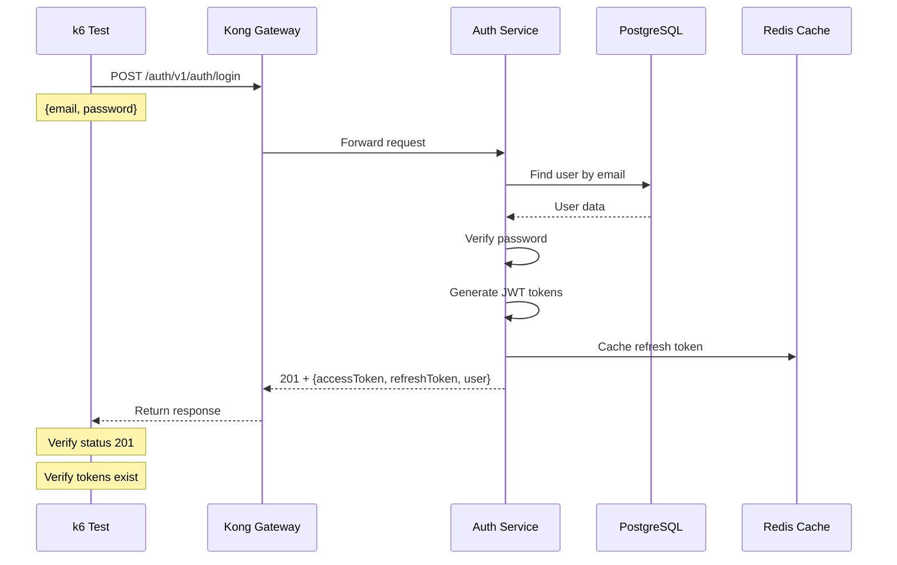

# Auth Login Test

## Flow Diagram



## Test Steps

1. Send POST request to `/auth/v1/auth/login` with test credentials
2. Verify response status is 201
3. Verify response contains `accessToken`
4. Verify response contains `refreshToken`
5. Verify response contains user data

## Expected Response

```json
{
  "statusCode": 201,
  "message": "User login successful.",
  "data": {
    "accessToken": "eyJhbGc...",
    "refreshToken": "eyJhbGc...",
    "user": {
      "id": "uuid",
      "email": "user@example.com",
      "role": "USER"
    }
  }
}
```

