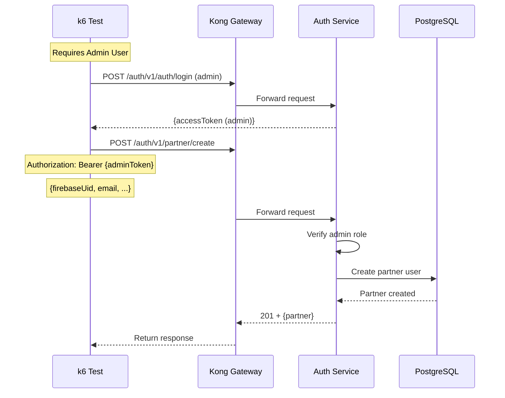

# Auth Partner Create Test

## Flow Diagram



## Test Steps

1. Login as admin user (if available)
2. Send POST request to `/auth/v1/partner/create` with Firebase UID
3. Verify response status is 201
4. Verify partner was created

## Note

This test is skipped if no admin user is available. It requires:
- Admin user credentials
- Firebase UID for partner creation

## Expected Response

```json
{
  "statusCode": 201,
  "message": "Partner created successfully.",
  "data": {
    "id": "uuid",
    "firebaseUid": "firebase-uid",
    "email": "partner@example.com",
    "role": "PARTNER"
  }
}
```

