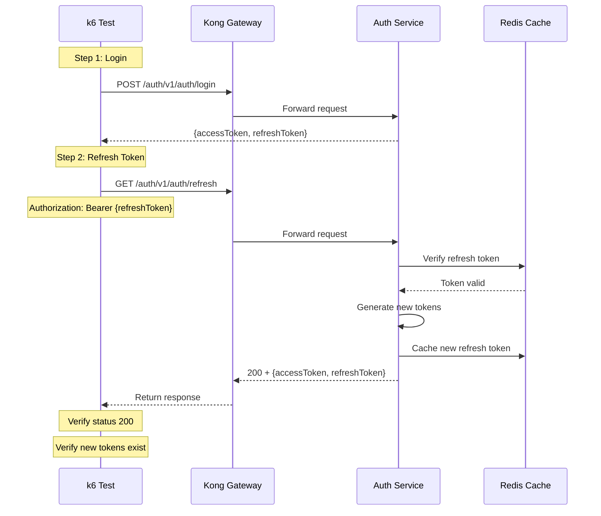

# Auth Refresh Token Test

## Flow Diagram



## Test Steps

1. Login to get refresh token
2. Send GET request to `/auth/v1/auth/refresh` with refresh token in Authorization header
3. Verify response status is 200
4. Verify response contains new `accessToken`
5. Verify response contains new `refreshToken`

## Expected Response

```json
{
  "statusCode": 200,
  "message": "Token refresh successful.",
  "data": {
    "accessToken": "eyJhbGc...",
    "refreshToken": "eyJhbGc..."
  }
}
```

