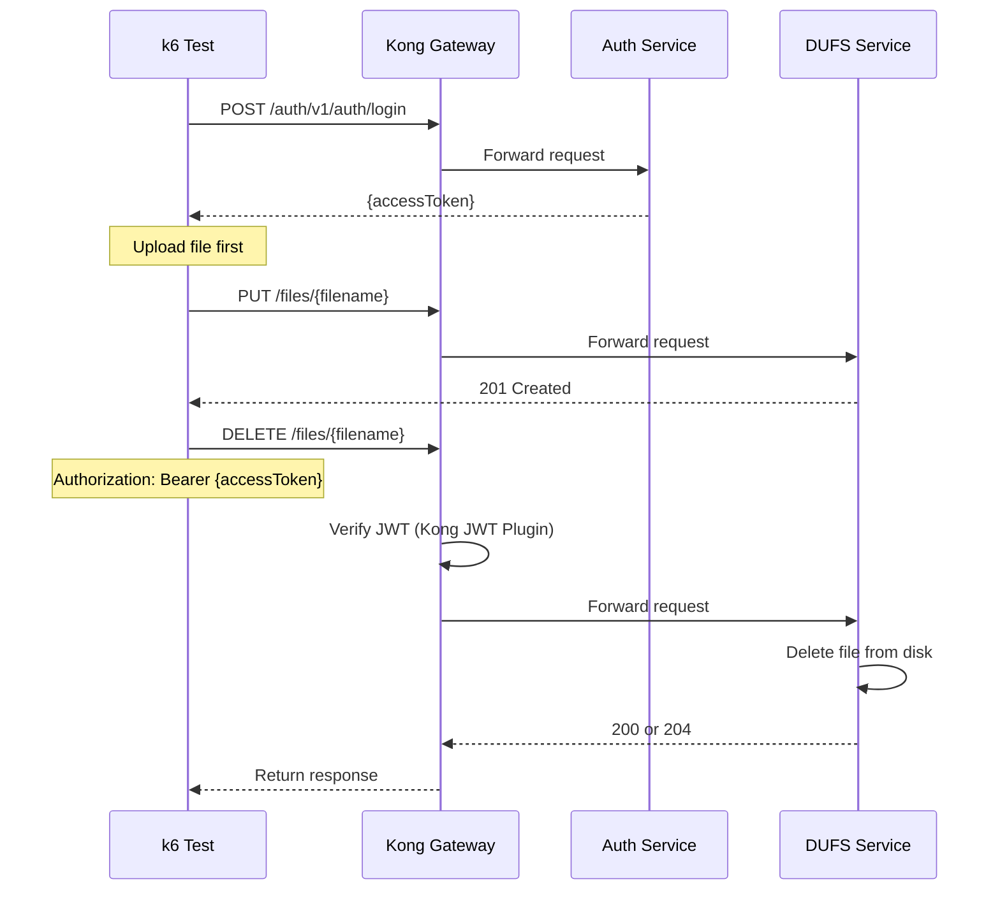

# DUFS Delete Test

## Flow Diagram

## Test Steps

1. Login to get access token
2. Upload a test file
3. Send DELETE request to `/files/{filename}`
4. Verify response status is 200 or 204
5. Verify file was deleted

