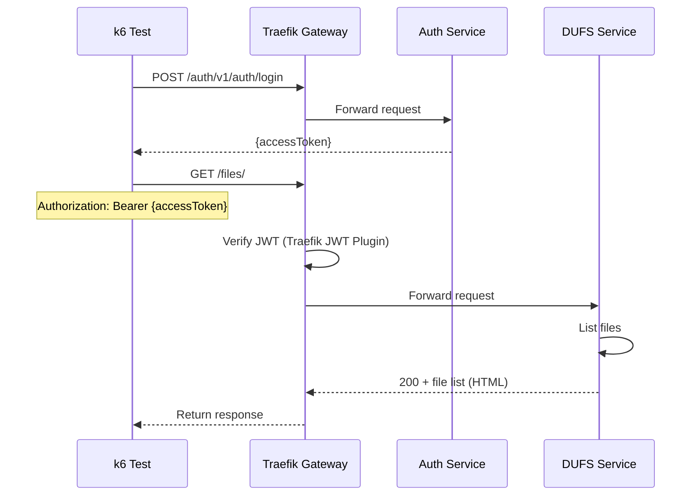

# DUFS Download Test

## Flow Diagram

```mermaid
sequenceDiagram
    participant K6 as k6 Test
    participant Traefik as Traefik Gateway
    participant Auth as Auth Service
    participant DUFS as DUFS Service

    K6->>Traefik: POST /auth/v1/auth/login
    Traefik->>Auth: Forward request
    Auth-->>K6: {accessToken}
    
    K6->>Traefik: GET /files/
    Note over K6: Authorization: Bearer {accessToken}
    Traefik->>Traefik: Verify JWT (Traefik JWT Plugin)
    Traefik->>DUFS: Forward request
    DUFS->>DUFS: List files
    DUFS-->>Traefik: 200 + file list (HTML)
    Traefik-->>K6: Return response
```

## Test Steps

1. Login to get access token
2. Send GET request to `/files/` to list files
3. Verify response status is 200
4. Verify file list is returned

