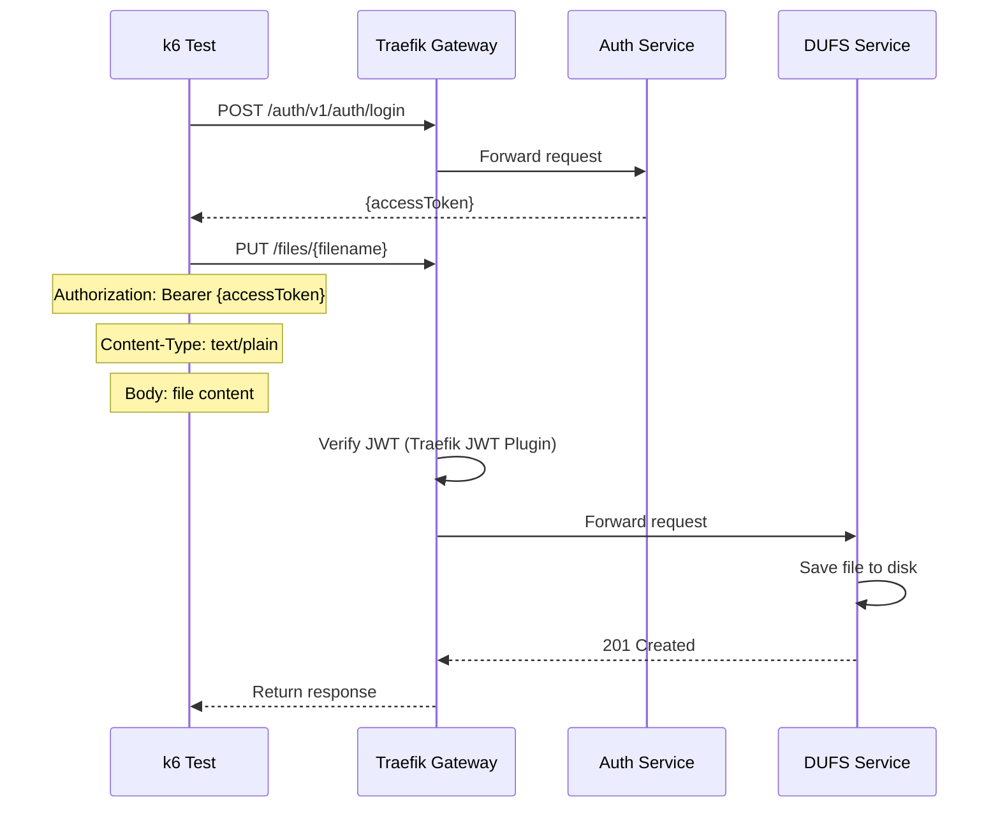

# DUFS Upload Test

## Flow Diagram

## Test Steps

1. Login to get access token
2. Generate unique filename
3. Send PUT request to `/files/{filename}` with file content
4. Verify response status is 201 or 200
5. Verify file was uploaded

