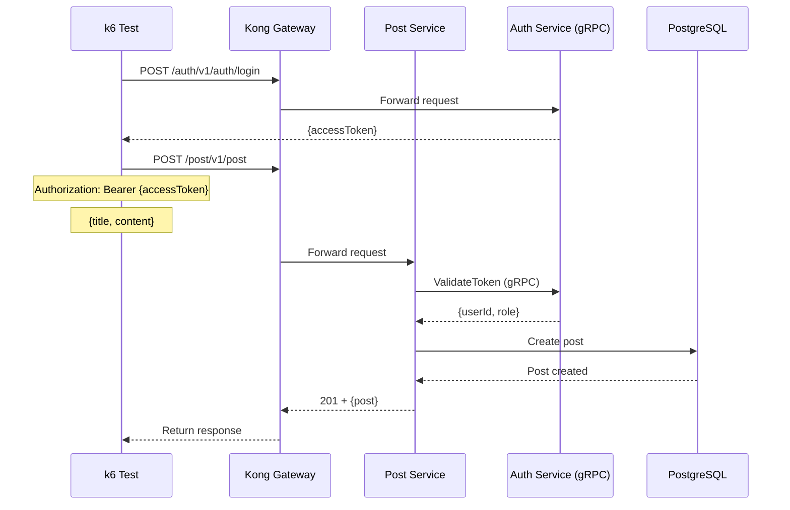

# Post Create Test

## Flow Diagram

## Test Steps

1. Login to get access token
2. Send POST request to `/post/v1/post` with post data
3. Verify response status is 201
4. Verify post was created with ID

