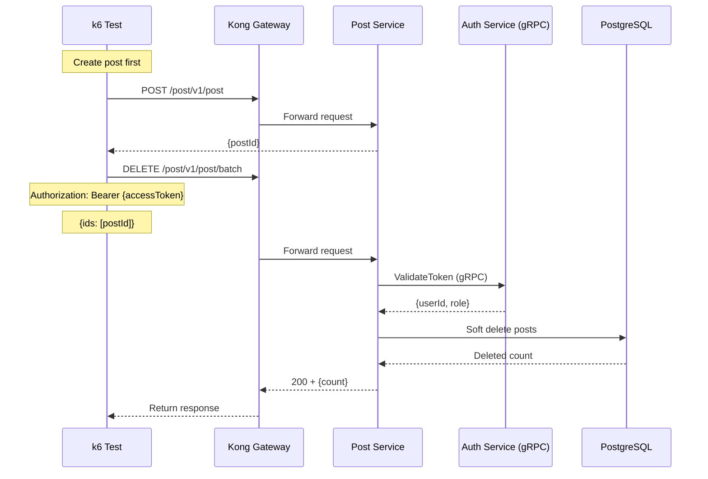

# Post Delete Test

## Flow Diagram

## Test Steps

1. Login to get access token
2. Create a post
3. Send DELETE request to `/post/v1/post/batch` with post IDs
4. Verify response status is 200
5. Verify posts were deleted (soft delete)

