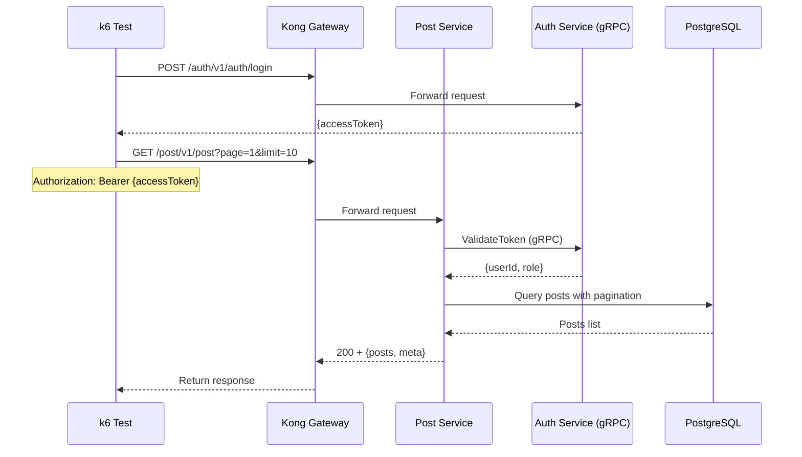

# Post List Test

## Flow Diagram

## Test Steps

1. Login to get access token
2. Send GET request to `/post/v1/post` with pagination params
3. Verify response status is 200
4. Verify response contains posts array and meta data

