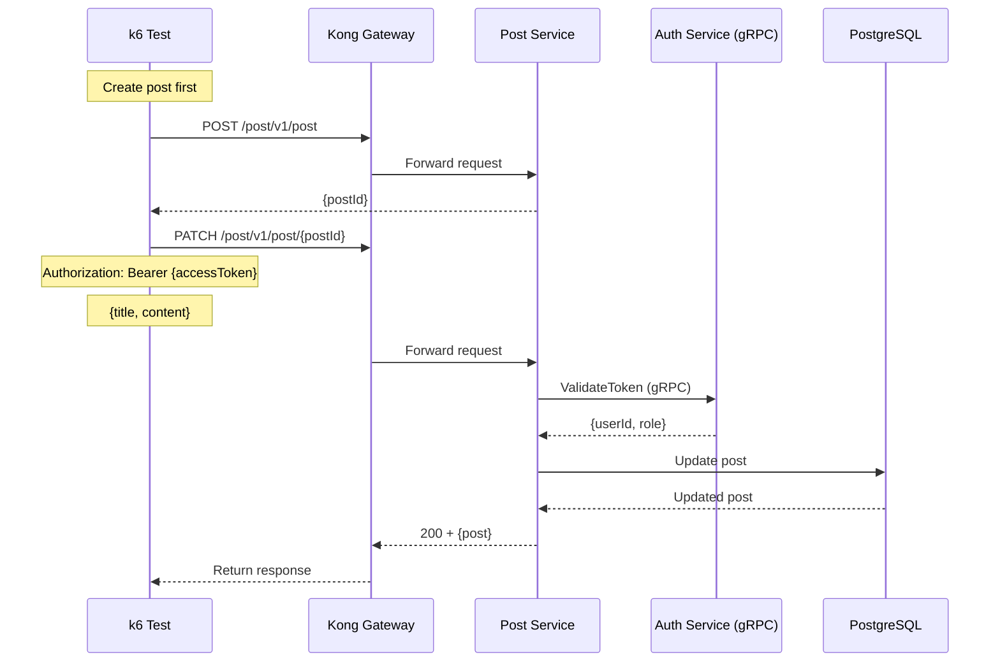

# Post Update Test

## Flow Diagram

## Test Steps

1. Login to get access token
2. Create a post
3. Send PATCH request to `/post/v1/post/{id}` with updated data
4. Verify response status is 200
5. Verify post was updated

