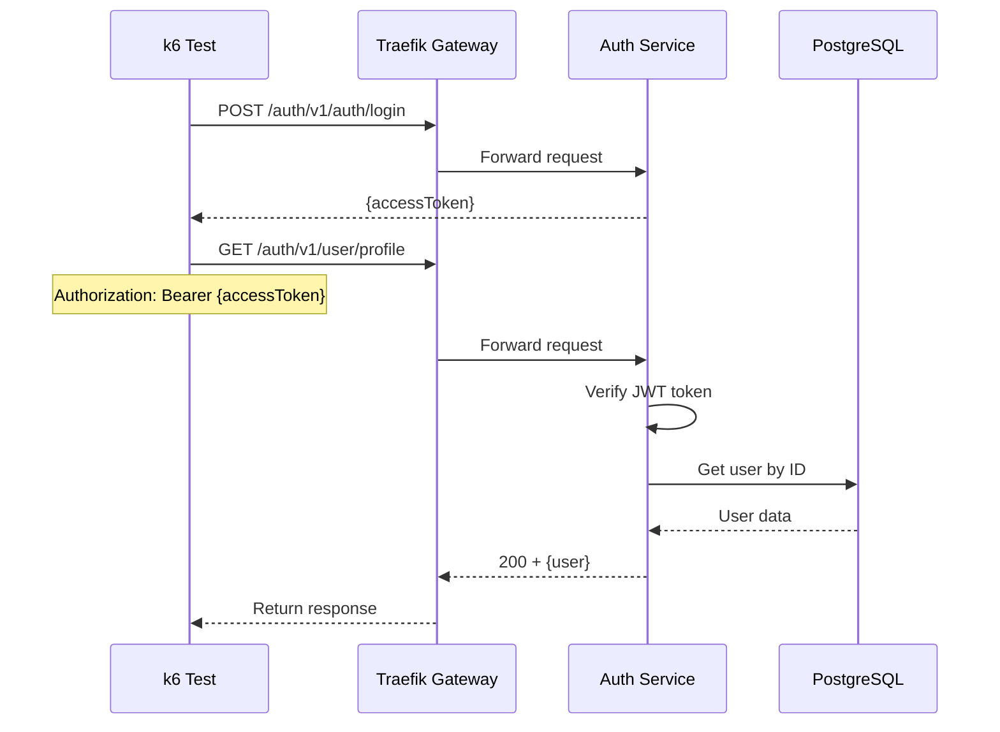

# User Get Profile Test

## Flow Diagram

## Test Steps

1. Login to get access token
2. Send GET request to `/auth/v1/user/profile` with access token
3. Verify response status is 200
4. Verify response contains user profile data

