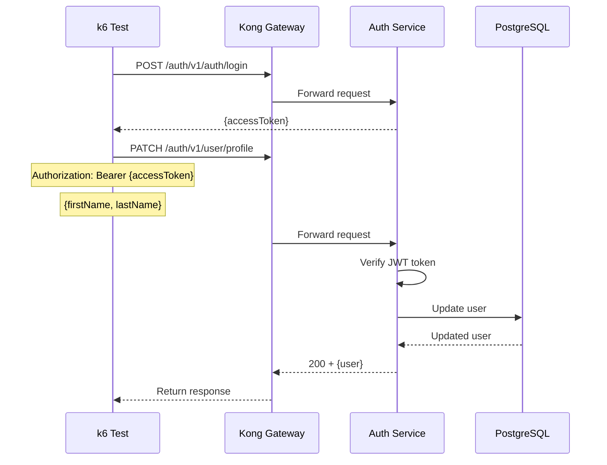

# User Update Profile Test

## Flow Diagram

## Test Steps

1. Login to get access token
2. Send PATCH request to `/auth/v1/user/profile` with updated data
3. Verify response status is 200
4. Verify profile was updated

