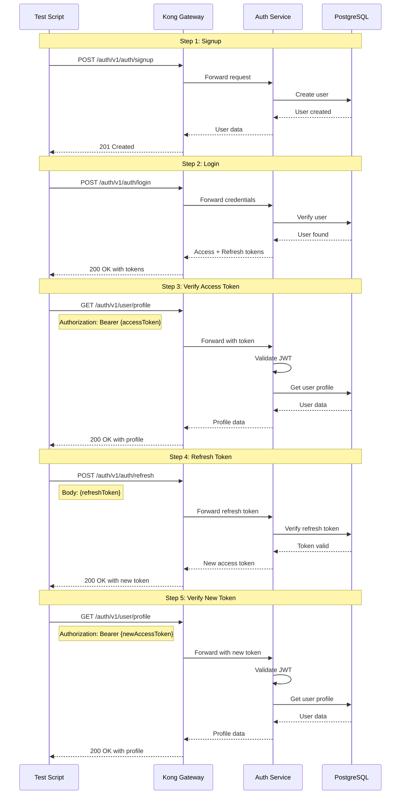

# Auth Flow Diagram

## Complete Authentication Flow

## Flow Steps

1. **Signup**: Create a new user account
   - Endpoint: `POST /auth/v1/auth/signup`
   - Input: email, password, firstName, lastName
   - Output: User data

2. **Login**: Authenticate and get tokens
   - Endpoint: `POST /auth/v1/auth/login`
   - Input: email, password
   - Output: accessToken, refreshToken

3. **Verify Access Token**: Use token to access protected resource
   - Endpoint: `GET /auth/v1/user/profile`
   - Header: `Authorization: Bearer {accessToken}`
   - Output: User profile data

4. **Refresh Token**: Get new access token
   - Endpoint: `POST /auth/v1/auth/refresh`
   - Input: refreshToken
   - Output: New accessToken

5. **Verify New Token**: Confirm new token works
   - Endpoint: `GET /auth/v1/user/profile`
   - Header: `Authorization: Bearer {newAccessToken}`
   - Output: User profile data

## Success Criteria

- ✅ User can signup successfully
- ✅ User can login with correct credentials
- ✅ Access token can access protected resources
- ✅ Refresh token can generate new access token
- ✅ New access token works correctly

