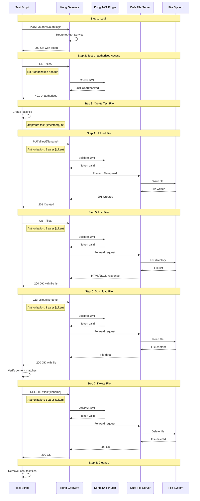

# DUFS Flow Diagram

## Complete File Management Flow

## Flow Steps

1. **Login**: Get access token
   - Endpoint: `POST /auth/v1/auth/login`
   - Output: accessToken

2. **Test Unauthorized Access**: Verify JWT protection
   - Endpoint: `GET /files/`
   - Expected: 401 Unauthorized

3. **Create Test File**: Generate local test file
   - Location: `/tmp/dufs-test-{timestamp}.txt`
   - Content: Test string

4. **Upload File**: Upload to DUFS
   - Endpoint: `PUT /files/{filename}`
   - Header: `Authorization: Bearer {token}`
   - Method: Binary upload
   - Expected: 201 Created

5. **List Files**: Get file listing
   - Endpoint: `GET /files/`
   - Header: `Authorization: Bearer {token}`
   - Expected: File appears in list

6. **Download File**: Download and verify
   - Endpoint: `GET /files/{filename}`
   - Header: `Authorization: Bearer {token}`
   - Verify: Content matches original

7. **Delete File**: Remove from server
   - Endpoint: `DELETE /files/{filename}`
   - Header: `Authorization: Bearer {token}`
   - Expected: 200 OK

8. **Cleanup**: Remove local test files

## Success Criteria

- ✅ Unauthorized access is blocked (401)
- ✅ File upload works with valid token
- ✅ Uploaded file appears in listing
- ✅ Downloaded file content matches original
- ✅ File deletion works correctly
- ✅ Kong JWT plugin protects all endpoints

## Key Features Tested

- **JWT Authentication**: Kong plugin validates tokens
- **File Upload**: Binary file upload via PUT
- **File Download**: Binary file download via GET
- **File Listing**: Directory listing
- **File Deletion**: Remove files from server
- **Content Verification**: Ensure data integrity

