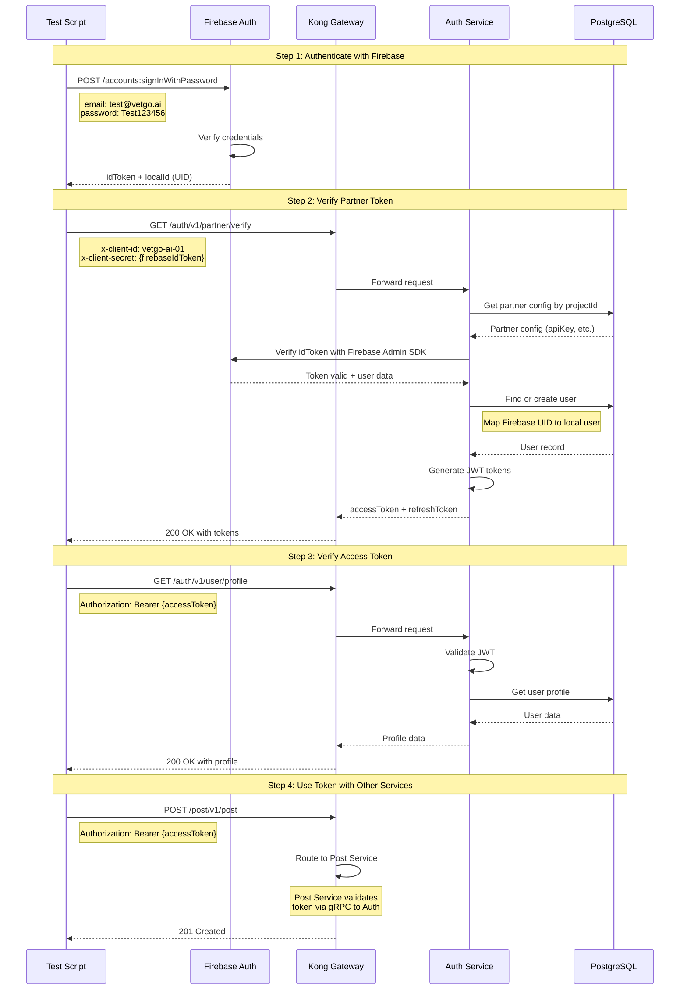

# Partner Verification Flow Diagram

## Firebase Partner Integration Flow

## Flow Steps

1. **Authenticate with Firebase**
   - Endpoint: `https://identitytoolkit.googleapis.com/v1/accounts:signInWithPassword`
   - Input: email, password, Firebase API key
   - Output: Firebase idToken and UID

2. **Verify Partner Token**
   - Endpoint: `GET /auth/v1/partner/verify`
   - Headers:
     - `x-client-id`: Partner project ID (e.g., "vetgo-ai-01")
     - `x-client-secret`: Firebase idToken
   - Process:
     - Auth service looks up partner config
     - Verifies token with Firebase Admin SDK
     - Maps Firebase UID to local user (create if not exists)
     - Generates our JWT tokens
   - Output: accessToken, refreshToken

3. **Verify Access Token**
   - Endpoint: `GET /auth/v1/user/profile`
   - Header: `Authorization: Bearer {accessToken}`
   - Output: User profile data

4. **Use Token with Other Services**
   - Example: Create post
   - Token works across all services
   - gRPC validation ensures consistency

## Partner Configuration

Partner must be registered in database with:
- `projectId`: Unique identifier (e.g., "vetgo-ai-01")
- `apiKey`: Firebase API key
- `authDomain`: Firebase auth domain
- `clientEmail`: Service account email
- `privateKey`: Service account private key
- `isActive`: true

## Success Criteria

- ✅ Firebase authentication succeeds
- ✅ Partner token verification succeeds
- ✅ User is created/found in local database
- ✅ JWT tokens are generated
- ✅ Tokens work with all services
- ✅ User profile is accessible

## Key Features Tested

- **Firebase Integration**: External auth provider
- **Partner Management**: Multi-tenant support
- **Token Exchange**: Firebase token → JWT token
- **User Mapping**: Firebase UID → Local user
- **Cross-Service Auth**: Token works everywhere
- **Admin SDK**: Server-side token verification

## Error Cases

- ❌ Invalid Firebase credentials → 401
- ❌ Invalid partner projectId → 404
- ❌ Inactive partner → 403
- ❌ Invalid Firebase token → 401
- ❌ Expired Firebase token → 401

