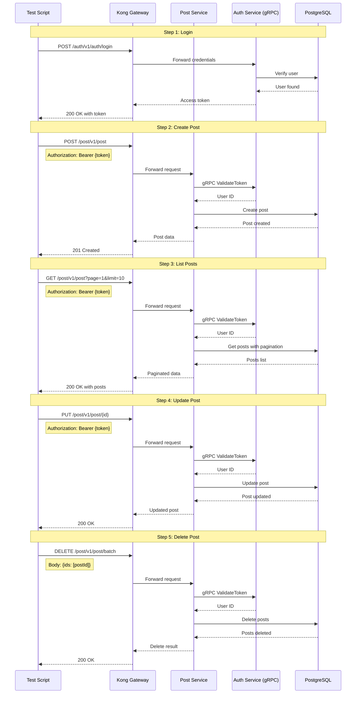

# Post Flow Diagram

## Complete Post Management Flow

## Flow Steps

1. **Login**: Get access token
   - Endpoint: `POST /auth/v1/auth/login`
   - Input: email, password
   - Output: accessToken

2. **Create Post**: Create a new post
   - Endpoint: `POST /post/v1/post`
   - Header: `Authorization: Bearer {token}`
   - Input: title, content
   - Output: Post data with ID

3. **List Posts**: Get paginated posts
   - Endpoint: `GET /post/v1/post?page=1&limit=10`
   - Header: `Authorization: Bearer {token}`
   - Output: Posts array with pagination metadata

4. **Update Post**: Update existing post
   - Endpoint: `PUT /post/v1/post/{id}`
   - Header: `Authorization: Bearer {token}`
   - Input: title, content
   - Output: Updated post data

5. **Delete Post**: Batch delete posts
   - Endpoint: `DELETE /post/v1/post/batch`
   - Header: `Authorization: Bearer {token}`
   - Input: Array of post IDs
   - Output: Delete count

## Success Criteria

- ✅ User can login successfully
- ✅ User can create post with valid token
- ✅ User can list posts with pagination
- ✅ User can update own post
- ✅ User can delete own posts
- ✅ gRPC token validation works correctly

## Key Features Tested

- **Authentication**: Token-based auth via Kong
- **Authorization**: gRPC validation between services
- **CRUD Operations**: Complete post lifecycle
- **Pagination**: List with page/limit parameters
- **Batch Operations**: Delete multiple posts at once

